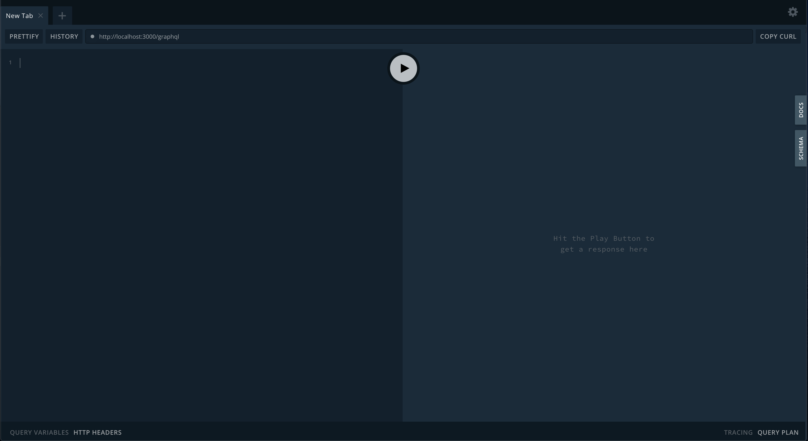

import Tabs from '@theme/Tabs';
import TabItem from '@theme/TabItem';

Let's create a simple todo-item graphql example.

## Set up a new nest app

```sh
npm i -g @nestjs/cli
nest new nestjs-query-getting-started
```

## Install Dependencies
```sh
npm i @nestjs-query/core
```
```sh
npm i @nestjs-query/query-graphql @nestjs/common @nestjs/graphql graphql graphql-relay class-transformer class-validator reflect-metadata type-graphql
``` 
```sh
npm i @nestjs-query/query-typeorm @nestjs/common @nestjs/typeorm class-transformer typeorm
```

Install extra dependencies for the example.
```sh
npm i pg apollo-server-express
```

## Generate files module

Create the todo-item module, service, resolver, entity and DTO.

```sh
# module
npx nest g mo todo-item
```

## Create the Entity

Generate the entity from the root of your project.

```sh
npx nest g cl todo-item.entity todo-item
```

Now lets fill out the entity that will be used by `typeorm`. Add the following to `src/todo-item/todo-item.entity.ts`. 

```ts
import {
  Column,
  CreateDateColumn,
  Entity,
  PrimaryGeneratedColumn,
  UpdateDateColumn,
} from 'typeorm';

@Entity()
export class TodoItemEntity {
  @PrimaryGeneratedColumn()
  id!: string;

  @Column()
  title!: string;

  @Column()
  completed!: boolean;

  @CreateDateColumn()
  created!: Date;

  @UpdateDateColumn()
  updated!: Date;
}
```

## Create the DTO

The DTO (Data Transfer Object) is used by the resolver to represent incoming requests and outgoing responses. 

The DTO is where you can: 

* Define fields that should be rendered by graphql.
* Define fields that should be filterable using the `@FilterableField` decorator.
* Define validation that will be used by mutations. 
 
The DTO can be combined with the entity, but a DTO defines a nice separation between the view model and database entity. In this example we will keep the separate.

Generate the DTO from the root of your project. 

```sh
npx nest g cl todo-item.dto todo-item
```

Now lets fill out the DTO. Add the following to `src/todo-item/todo-item.dto.ts`.

```ts
import { FilterableField } from '@nestjs-query/query-graphql';
import { ObjectType, ID, GraphQLISODateTime } from 'type-graphql';

@ObjectType('TodoItem')
export class TodoItemDTO {
  @FilterableField(() => ID)
  id!: string;

  @FilterableField()
  title!: string;

  @FilterableField()
  completed!: boolean;

  @FilterableField(() => GraphQLISODateTime)
  created!: Date;

  @FilterableField(() => GraphQLISODateTime)
  updated!: Date;
}

```

Notice the use of `@FilterableField` this will let `@nestjs-query/query-graphql` know to allow filtering on that field. If you just use `@Field` then you will not be able to filter on that field.

## Create the Service

The service in this example is extending the `@nestjs-query/query-typeorm` `TypeormQueryService`. 

The `TypeormQueryService` will provide implementations for:

* `query` - find multiple records.
* `queryOne` - find one record.
* `findById` - find a record by its id.
* `getById` - get a record by its id or return a rejected promise with a NotFound error.
* `createMany` - create multiple records.
* `createOne` - create one record.
* `updateMany` - update many records.
* `updateOne` - update a single record.
* `deleteMany` - delete multiple records.
* `deleteOne` - delete a single record.

Generate the service file.

```sh
npx nest g s todo-item
```

Now add the following to `src/todo-item/todo-item.service.ts`.

```ts
import { Injectable } from '@nestjs/common';
import { TypeormQueryService } from '@nestjs-query/query-typeorm';
import { InjectRepository } from '@nestjs/typeorm';
import { Repository } from 'typeorm';
import { TodoItemEntity } from './todo-item.entity';

@Injectable()
export class TodoItemService extends TypeormQueryService<TodoItemEntity> {
  constructor(
    @InjectRepository(TodoItemEntity) repo: Repository<TodoItemEntity>,
  ) {
    super(repo);
  }
}

```

The important piece is extending `TypeormQueryService` from `@nestjs-query/query-typeorm` this will give you all of the crud methods that your resolver will use.

## Create the Resolver

The resolver will extend `@nestjs-query/query-graphql` `GraphQLQueryResolver`.

The `GraphQLQueryResolver` will expose the following graphql queries and mutations. 

**NOTE** the names created for the queries and mutations will be based on the DTO class name or the provided `typeName`.

**Queries**

* `todoItems` - Find multiple `TodoItem`s.

**Mutations**

* `createManyTodoItems` - create multiple `TodoItem`s.
* `createOneTodoItems` - create one `TodoItem`.
* `updateManyTodoItems` - update multiple `TodoItems`.
* `updateOneTodoItems` - update one `TodoItem`.
* `deleteManyTodoItems` - delete multiple `TodoItems`s.
* `deleteOneTodoItems` - delete one `TodoItem`. 

Generate the resolver file.
```sh
npx nest g r todo-item
```

Now add the following to `src/todo-item/todo-item.resolver.ts`.

```ts
import { GraphQLQueryResolver } from '@nestjs-query/query-graphql';
import { Resolver, Query, Args } from '@nestjs/graphql';
import { TodoItemDTO } from './todo-item.dto';
import { TodoItemService } from './todo-item.service';

@Resolver()
export class TodoItemResolver extends GraphQLQueryResolver(TodoItemDTO, {
  // the name you want all the generated types to use with.
  typeName: 'TodoItem',
}) {
  constructor(readonly service: TodoItemService) {
    super(service);
  }
}


```

Notice how `GraphQLQueryResolver` is extended, this will automatically add all of the crud graphql queries and mutations.

By default `GraphQLQueryResolver` will use the class name to generate the names for all generated graphql types. In this example we'll override that so `TodoItem` instead of `TodoItemDTO` will be used.

## Wire everything up.

Update the `todo-item.module` to register the entities.

```ts
import { Module } from '@nestjs/common';
import { TodoItemService } from './todo-item.service';
import { TodoItemResolver } from './todo-item.resolver';
import { TypeOrmModule } from '@nestjs/typeorm';
import { TodoItemEntity } from './todo-item.entity';

@Module({
  providers: [TodoItemService, TodoItemResolver],
  // add this line.
  imports: [TypeOrmModule.forFeature([TodoItemEntity])],
})
export class TodoItemModule {}
```

Update `app.module` to import the `typeorm` and `graphql` nest modules.

```ts
import { Module } from '@nestjs/common';
import { GraphQLModule } from '@nestjs/graphql';
import { TypeOrmModule } from '@nestjs/typeorm';
import { AppController } from './app.controller';
import { AppService } from './app.service';
import { TodoItemModule } from './todo-item/todo-item.module';
import { TodoItemEntity } from './todo-item/todo-item.entity';

@Module({
  imports: [
    TypeOrmModule.forRoot({
      // use in memory sqlite
      type: 'postgres',
      database: 'gettingstarted',
      username: 'gettingstarted',
      entities: [TodoItemEntity],
      synchronize: true,
      logging: true,
    }),
    GraphQLModule.forRoot({
      // set to true to automatically generate schema
      autoSchemaFile: true,
    }),
    TodoItemModule,
  ],
  controllers: [AppController],
  providers: [AppService],
})
export class AppModule {}

```

Create a `docker-compose.yml` file in the root of the project

```dockerfile
version: "3"

services:
  postgres:
    image: "postgres:11.5"
    environment:
      - "POSTGRES_USER=gettingstarted"
      - "POSTGRES_DB=gettingstarted"
    expose:
      - "5432"
    ports:
      - "5432:5432"

```

## Running the Example

Start the backing services
```sh
docker-compose up -d
```

Start the app

```sh
npm start
```

Visit http://localhost:3000/graphql where you should see the playground



## Exploring The GraphQL Endpoint

### Create a TodoItem

<Tabs
  defaultValue="graphql"
  values={[
    { label: 'GraphQL', value: 'graphql', },
    { label: 'Response', value: 'response', },
  ]
}>
<TabItem value="graphql">

```graphql
mutation {
  createOneTodoItem(
    input: { item: { title: "Create One Todo Item", completed: false } }
  ) {
    id
    title
    completed
    created
    updated
  }
}
```

</TabItem>
<TabItem value="response">

```json
{
  "data": {
    "createOneTodoItem": {
      "id": "1",
      "title": "Create One Todo Item",
      "completed": false,
      "created": "2020-01-01T00:43:16.000Z",
      "updated": "2020-01-01T00:43:16.000Z"
    }
  }
}
```

</TabItem>
</Tabs>

### Create Multiple TodoItems

<Tabs
  defaultValue="graphql"
  values={[
    { label: 'GraphQL', value: 'graphql', },
    { label: 'Response', value: 'response', },
  ]
}>
<TabItem value="graphql">

```graphql
mutation {
  createManyTodoItems(
    input: {
      items: [
        { title: "Create Many Todo Items - 1", completed: false }
        { title: "Create Many Todo Items - 2", completed: true }
      ]
    }
  ) {
    id
    title
    completed
    created
    updated
  }
}
```

</TabItem>
<TabItem value="response">

```json
{
  "data": {
    "createManyTodoItems": [
      {
        "id": "2",
        "title": "Create Many Todo Items - 1",
        "completed": false,
        "created": "2020-01-01T00:49:01.000Z",
        "updated": "2020-01-01T00:49:01.000Z"
      },
      {
        "id": "3",
        "title": "Create Many Todo Items - 2",
        "completed": true,
        "created": "2020-01-01T00:49:01.000Z",
        "updated": "2020-01-01T00:49:01.000Z"
      }
    ]
  }
}
```

</TabItem>
</Tabs>

### Query For TodoItems

#### Query for all todo items

<Tabs
  defaultValue="graphql"
  values={[
    { label: 'GraphQL', value: 'graphql', },
    { label: 'Response', value: 'response', },
  ]
}>
<TabItem value="graphql">

```graphql
{
  todoItems{
    pageInfo{
      hasNextPage
      hasPreviousPage
      startCursor
      endCursor
    }
    edges{
      node{
        id
        title
        completed
        created
        updated
      }
      cursor
    }
  }
}
```


</TabItem>
<TabItem value="response">


```json
{
  "data": {
    "todoItems": {
      "pageInfo": {
        "hasNextPage": false,
        "hasPreviousPage": false,
        "startCursor": "YXJyYXljb25uZWN0aW9uOjA=",
        "endCursor": "YXJyYXljb25uZWN0aW9uOjI="
      },
      "edges": [
        {
          "node": {
            "id": "1",
            "title": "Create One Todo Item",
            "completed": false,
            "created": "2020-01-01T00:43:16.000Z",
            "updated": "2020-01-01T00:43:16.000Z"
          },
          "cursor": "YXJyYXljb25uZWN0aW9uOjA="
        },
        {
          "node": {
            "id": "2",
            "title": "Create Many Todo Items - 1",
            "completed": false,
            "created": "2020-01-01T00:49:01.000Z",
            "updated": "2020-01-01T00:49:01.000Z"
          },
          "cursor": "YXJyYXljb25uZWN0aW9uOjE="
        },
        {
          "node": {
            "id": "3",
            "title": "Create Many Todo Items - 2",
            "completed": true,
            "created": "2020-01-01T00:49:01.000Z",
            "updated": "2020-01-01T00:49:01.000Z"
          },
          "cursor": "YXJyYXljb25uZWN0aW9uOjI="
        }
      ]
    }
  }
}
```

</TabItem>
</Tabs>

#### Query for completed todo items

<Tabs
  defaultValue="graphql"
  values={[
    { label: 'GraphQL', value: 'graphql', },
    { label: 'Response', value: 'response', },
  ]
}>
<TabItem value="graphql">

```graphql
{
  todoItems(filter: {completed: {is: true}}){
    pageInfo{
      hasNextPage
      hasPreviousPage
      startCursor
      endCursor
    }
    edges{
      node{
        id
        title
        completed
        created
        updated
      }
      cursor
    }
  }
}
```

</TabItem>
<TabItem value="response">

```json
{
  "data": {
    "todoItems": {
      "pageInfo": {
        "hasNextPage": false,
        "hasPreviousPage": false,
        "startCursor": "YXJyYXljb25uZWN0aW9uOjA=",
        "endCursor": "YXJyYXljb25uZWN0aW9uOjA="
      },
      "edges": [
        {
          "node": {
            "id": "3",
            "title": "Create Many Todo Items - 2",
            "completed": true,
            "created": "2020-01-01T00:49:01.000Z",
            "updated": "2020-01-01T00:49:01.000Z"
          },
          "cursor": "YXJyYXljb25uZWN0aW9uOjA="
        }
      ]
    }
  }
}
```

</TabItem>
</Tabs>

### Update a TodoItem

Lets update the completed `TodoItem` we created earlier to not be completed.
<Tabs
  defaultValue="graphql"
  values={[
    { label: 'GraphQL', value: 'graphql', },
    { label: 'Response', value: 'response', },
  ]
}>
<TabItem value="graphql">

```graphql
mutation {
  updateOneTodoItem(input: { id: "3", update: { completed: false } }) {
    id
    title
    completed
    created
    updated
  }
}
```

</TabItem>
<TabItem value="response">

```json
{
  "data": {
    "updateOneTodoItem": {
      "id": "3",
      "title": "Create Many Todo Items - 2",
      "completed": false,
      "created": "2020-01-01T00:49:01.000Z",
      "updated": "2020-01-01T01:06:09.000Z"
    }
  }
}
```

</TabItem>
</Tabs>

### Update Multiple TodoItems

Lets update the completed `TodoItem` we created earlier to not be completed.
<Tabs
  defaultValue="graphql"
  values={[
    { label: 'GraphQL', value: 'graphql', },
    { label: 'Response', value: 'response', },
  ]
}>
<TabItem value="graphql">

```graphql
mutation {
  updateManyTodoItems(
    input: { filter: { id: { in: ["1", "2"] } }, update: { completed: true } }
  ) {
    updatedCount
  }
}

```

</TabItem>
<TabItem value="response">

```json
{
  "data": {
    "updateManyTodoItems": {
      "updatedCount": 2
    }
  }
}
```

</TabItem>
</Tabs>

You can check this by running the completed query from above.


### Delete One TodoItem

Lets update delete the first `TodoItem`.
<Tabs
  defaultValue="graphql"
  values={[
    { label: 'GraphQL', value: 'graphql', },
    { label: 'Response', value: 'response', },
  ]
}>
<TabItem value="graphql">

```graphql
mutation {
  deleteOneTodoItem(input: {id: "1"}){
    id
    title
    completed
    created
    updated
  }
}
```

</TabItem>
<TabItem value="response">

```json
{
  "data": {
    "deleteOneTodoItem": {
      "id": null,
      "title": "Create One Todo Item",
      "completed": true,
      "created": "2020-01-01T14:30:19.222Z",
      "updated": "2020-01-01T14:30:29.518Z"
    }
  }
}
```

</TabItem>
</Tabs>

### Delete Many TodoItems

Lets update delete the create many todo items `TodoItem` using a filter.

<Tabs
  defaultValue="graphql"
  values={[
    { label: 'GraphQL', value: 'graphql', },
    { label: 'Response', value: 'response', },
  ]
}>
<TabItem value="graphql">

```graphql
mutation {
  deleteManyTodoItems(
    input: { filter: { title: { like: "Create Many Todo Items%" } } }
  ) {
    deletedCount
  }
}

```

</TabItem>
<TabItem value="response">

```json
{
  "data": {
    "deleteManyTodoItems": {
      "deletedCount": 2
    }
  }
}
```

</TabItem>
</Tabs>

